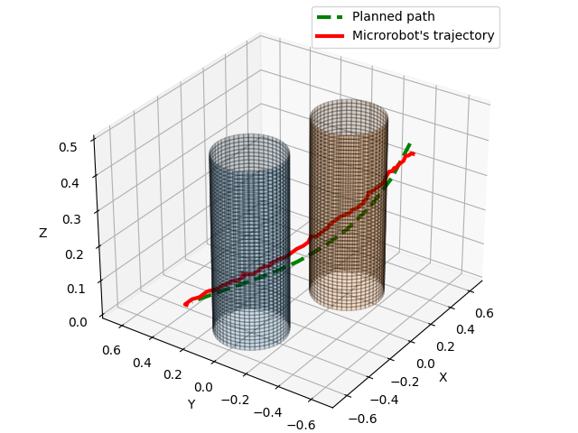
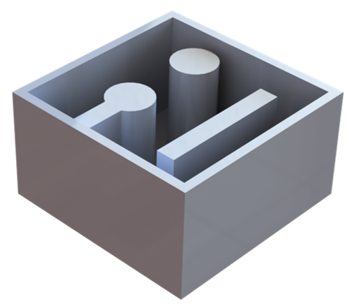
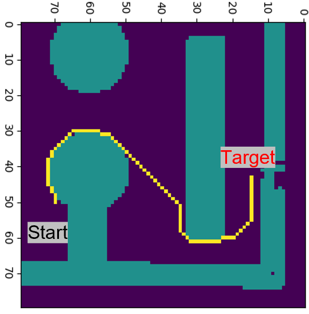

# **Autonomous 3D positional control of a magnetic microrobot using reinforcement learning**

## **Important Note**
For reproducibility in physical environment, as the code is directly linked to imaging system and Electromagnetic actuation system, it is not possible to run it as it is. However for simulation environment, the data in folder "Training_Simulation_Env" can be downloaded and code can be run on windows-based system using Python 3.8 for demonstration of learned simulation model and can be modified for training purposes (requirenment.txt file in the folder for all the dependencies).

## Sections:

1. Training_Simulation_Env
2. Training_EAS
3. Fully Autonomous Navigation
4. Simulation_Env_Unity.zip

### 1. Training Simulation Env
Testing and reproduction possible as the Simulation environment is given in the forlder.
This folder includes the files for Simulation Environment and the code for training and testing the environment.
requirement.txt file is included.

### 2. Training EAS
Testing and reproduction possible with the necessary changes in image aquisition code and current control code.
This folder includes the files for make Training environment of Electromagnetic Actuation System, Image processing, Camera access, Training and Evaluation.
requirement.txt file is included.

pylon Camera Software Suite is also required for camera access (https://www.baslerweb.com/en/products/basler-pylon-camera-software-suite/)
### 3. Fully Autonomous Navigation
This folder includes the files for A-Star algorithm implementation and results
requirement.txt file is included.

### 4. Simulation Env Unity
There is a .zip file in data section that includes Unity3D code for Simulation Environment

Unity version : 2020.3.35f1

NumSharp needs to be installed in Unity3D

Note: Final built Environment Available as .exe in "Training Simulation Env"

## Navigation around Virtual Obstacle

## Navigation in Physical Environment

